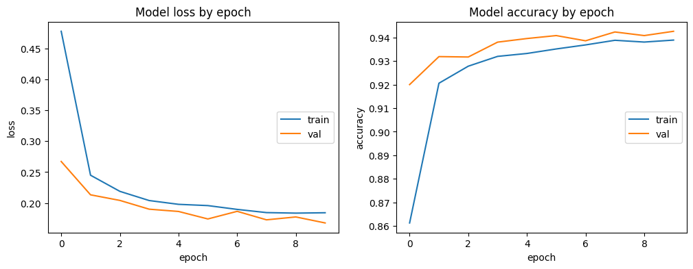

# Report 2: Modeling Report

## Stages of the Project

### Classification of the Problem

**What kind of machine learning problem is your project like? (classification, regression, clustering, etc)**  
Classification.

**What task does your project relate to? (fraud detection, facial recognition, sentiment analysis, etc)?**  
Image classification for plants and plant disease detection.

**What is the main performance metric used to compare your models? Why this one?**  
Accuracy and Loss  
Loss quantifies the discrepancy between the actual values and those predicted by a model, with a higher loss indicating greater prediction errors, whereas accuracy measures the proportion of correct predictions, so a higher accuracy reflects fewer misclassifications on the dataset.

- **Graph 1:** Model Perfomance of the first training phase with freezed weights 

- **Graph 2:** 
Model Perfomance of the second training phase with partly unfreezed weights 

**Did you use other qualitative or quantitative performance metrics? If yes, detail it.**  
Gradcam and Shap

-Grad-CAM (Gradient-weighted Class Activation Mapping) is a technique used to visualize which parts of an input image a neural network focuses on when making a decision. It highlights important regions in the image that influence the model's prediction.  
-SHAP (SHapley Additive exPlanations) is a method for explaining individual predictions of any machine learning model by assigning each feature an importance value. It shows how much each feature contributes to pushing the prediction higher or lower.

- **Graph 3:** 

- **Graph 4:** 

## Model Choice and Optimization

**What algorithms have you tried?**  
Convolutional Neural Network (CNN), classical ML-algorithms as a classification layer

**Describe which one(s) you selected and why?**  
The selected model is a MobileNetV2 architecture, pre-trained on the ImageNet dataset, which is then fine-tuned for the specific task of plant disease classification.

- **Graph 5:** 

**Did you use parameter optimization techniques such as Grid Search and Cross Validation?**  
We used Cross Validation and fine tuning of the pre-trained model.

**Have you tested advanced models? Bagging, Boosting, Deep Learning… Why?**  
Yes. They work best.

## Interpretation of Results

**Have you analyzed the errors in your model?**  
Yes.  
-In our self-made CNN, the model became overfitted because the loss and accuracy on the training data continued to increase, while the validation data remained stagnant.  
-When we used machine learning algorithms, our model performed very well, especially since it was expected not to work effectively on images. We were surprised to see that the precision, recall, and F1-score were all around 0.99 or 1 for logistic regression and SVM, with an accuracy exceeding 99%.

**Did this contribute to his improvement? If yes, describe.**  
No.

**Have you used interpretability techniques such as SHAP, LIME, Skater… (Grad-CAM for Deep Learning…)**  
Yes, to see where the focus of the pictures lies.

**What has (or not) generated a significant improvement in your performance?**  
Transfer Learning